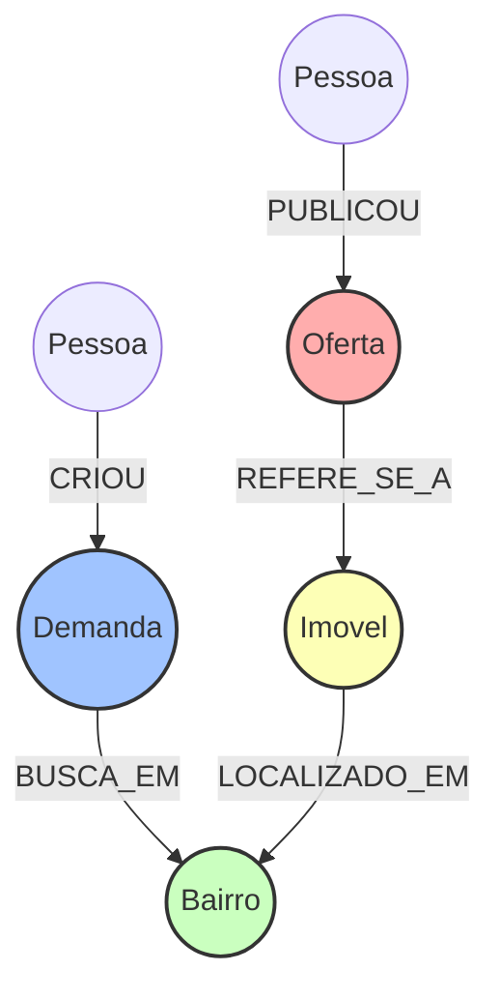

# Evolução Arquitetural - Sentinel Bot

Este documento descreve a evolução da arquitetura do Sentinel Bot, saindo de um modelo fortemente acoplado para uma arquitetura orientada a eventos e baseada em grafos.

## "As-Is" (Estado Atual)

Atualmente, o sistema sofre com gargalos de performance e escalabilidade devido a duas decisões de design:

1. **Polling no PostgreSQL:** O motor analítico e os serviços de despacho verificam constantemente o banco de dados em busca de novas mensagens ou oportunidades, gerando sobrecarga.
2. **Iteração O(N * M) no Python:** O algoritmo de matching cruza listas de compradores e vendedores em memória, o que causa estouro de memória e lentidão extrema quando o volume de dados cresce.

## "To-Be" (Arquitetura Alvo)

A nova arquitetura introduz um Message Broker (RabbitMQ) para desacoplar os serviços e adota o Neo4j de forma nativa para resolver o matching de forma muito mais eficiente através da travessia de nós.

### Diagrama 1: Fluxo do Produto To-Be

```mermaid
graph TD
    A[wpp-collector] -->|Publica Mensagem Bruta| B(RabbitMQ)
    B -->|Consome Mensagem Bruta| C[intel-engine]
  
    C -->|Persiste Dados Estruturados| D[(PostgreSQL)]
    C -->|Sincroniza Nós e Arestas| E[(Neo4j)]
  
    E -->|Matching Nativo (Cypher)| C
  
    C -->|Publica Oportunidade| B
    B -->|Consome Oportunidade| F[wpp-egress]
    F -->|Envia Notificação| G[WhatsApp]
```

### Diagrama 2: Leitura e Matching em Grafos

O matching deixará de ser um cruzamento iterativo de listas no Python e passará a ser uma consulta de grafos no Neo4j, reduzindo drasticamente a complexidade computacional.


